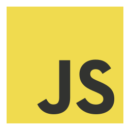

<!--  -->

&nbsp;&nbsp;

<h1 align="center">👋&nbsp; About Me!</h1>

Hi, I'm a Software Developer with a passion for exploring the intersection of art and technology. I specialize in creating immersive experiences that captivate audiences and leave a lasting impression. Thank you!

- 👨‍💻 Best projects available at [santhony.portfolio](https://santhony.netlify.app)

- 📄 Know about my experiences: [resume](https://docs.google.com/document/d/1NBylvw9Th97QOjqhKyZkAS3XX0kxTUbghqiXap15QcY/edit?usp=sharing)

<h3 align="left">Connect with me:</h3>

  
  
## 📊 Stats
  

  
## 🐍 &nbsp; Languages

|  |  |  |  |
| ----------- | ----------- | ----------- | ----------- |
 |  |  |  |
|  |  |  |  |

<h1 align="center">⚡&nbsp; Projects</h1>

- <b>Jar-Jar Beats</b>
  - A music playlist creator that allows the user to create a playlist and add songs to it. The user can also search for songs and add them to the playlist.
  - [Repo](https://github.com/orgs/MVP-Music-Variant-Project/repositories)

- <b>PB&J</b>
  - A final project that a user can create their own sandwich and will render on the menu in which they can vote for as many times as they want.
  - [Repo](https://github.com/PeanutButter-and-JavaScript/PB-JS)
  - [Netlify](https://peanutbutter-and-javascript.github.io/PB-JS/)

- <b>Odd Duck</b>
  - Displays three images that the user can vote for and once after they vote 25 times a graph with dispaly showing the results.
  - [Repo](https://github.com/AnthonySinitsa/odd-duck)

<!-- - [Python Data Structures and Algorithms](https://github.com/AnthonySinitsa/data-structures-and-algorithms/tree/main/python) -->

<!-- 

 -->

<h1 align="center">🔧 Tools</h1>

| | | |
| ----------- | ----------- | ----------- |
|  Mongo |  Express.js |  React |
|  Node |  Next |  Django
|  TailwindCSS |   Docker |  PostgreSQL
| AWS |  Netlify |  Bash
| Git | Github | Linux
|  Angular | Bootstrap |  Pandas |

## Hobbies / Interests

    𝄢 Love playing the piano and bass!

<!-- <h1 align="center"> Connect with me !</h1>

  &nbsp;  &nbsp;&nbsp; [Linkedin](https://www.linkedin.com/in/anthony-sinitsa-873a22215/)

<h2  align="center">📚 Resources Used to Build This Repo:</h2>

- Header from Canva

- Social media favicons from Icons8

- README Statistics from anuraghazra

- Emojis from webfx.com

- emojipedia.org -->

<!--  -->
